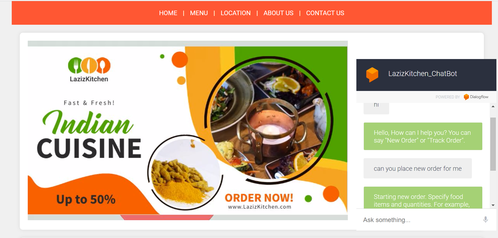

# LazizKitchen: ChatBot
[](https://your-chatbot-url) [](https://your-nlp-url) [](https://fastapi.tiangolo.com/) [](https://dialogflow.com/) [](https://www.mysql.com/) [](https://your-datascience-url)


Welcome to LazizKitchen, a chatbot project that integrates Dialogflow, FastAPI, and MySQL to create a seamless conversational experience. This repository houses the code for the chatbot, including the FastAPI backend, the Dialogflow training assets, and the static website.

## Project Overview



The project primarily utilizes three key components: Dialogflow, FastAPI, and a MySQL database. Dialogflow is employed for natural language processing, FastAPI serves as the backend framework, and MySQL stores essential data for order management.

### Features

1. **Place New Order**: Users can initiate and place new orders seamlessly through the chatbot.
2. **Describe Food Items**: The chatbot provides detailed descriptions of listed food items upon request.
3. **Remove Food Items**: Users have the option to remove food items from their order if not required.
4. **Complete Order**: The chatbot facilitates the completion of orders, ensuring a smooth and efficient process.
5. **Order Tracking**: Users can track the status of their orders through the chatbot.

## Directory Structure

- **Backend**: Contains the FastAPI backend code responsible for handling chatbot requests.
  
- **DataBase**: Includes the MySQL database dump. Import this dump into your MySQL database using tools like MySQL Workbench.

- **Dialogflow_Asets**: Holds the training phrases and other assets used to train the Dialogflow intents.

- **Frontend**: Houses the code for the static website, providing a user-friendly interface for interacting with the chatbot.

- **Images**: Contains the snapshot of website and chatbot.

## Installation

To set up the project, install the required Python modules:

```bash
pip install mysql-connector
pip install "fastapi[all]"
```

Alternatively, you can install both modules at once by running:

```bash
pip install -r Backend/requirements.txt
```

## Starting the FastAPI Backend Server

Follow these steps to launch the FastAPI backend server:

1. Navigate to the backend directory in your command prompt.
2. Run the following command:
```bash
uvicorn main:app --reload
```

## Ngrok for HTTPS Tunneling

Using Ngrok to expose our local server to the internet, and we want to set up a fulfillment webhook in Dialogflow to communicate with our local server, we need to use the Ngrok-provided public URL.

Follow these steps to set up Ngrok:

1. Visit https://ngrok.com/download to download Ngrok for your operating system.
2. Extract the zip file and place ngrok.exe in a folder.
3. Open the Windows command prompt, navigate to that folder, and run the following command:

```bash
ngrok http 8000
```
**Note:** Ngrok sessions timeout after every 2 hours. If you encounter a session expired message, restart the session.

Feel free to explore the directories and customize the chatbot according to your needs. If you have any questions or encounter issues, please refer to the documentation or reach out to the community for support.

Happy chatting with LazizKitchen ChatBot!
